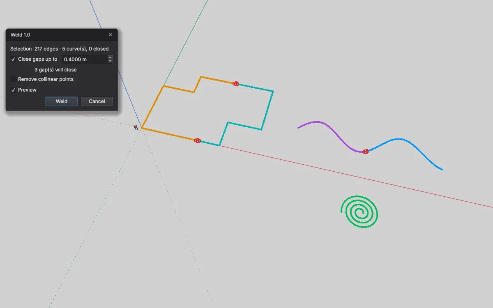

# Weld — Kanten zu Kurven verschweißen für IngeTrazo

Verbindet lose Kanten zu **einer Kurve**, die sich mit einem Klick auswählen lässt — wie ein Kreis oder Bogen — und schließt dabei kleine Lücken. Praktisch für importierte Pläne (DXF/DWG/PDF), deren Umrisse aus Hunderten Einzelsegmenten bestehen.

[English → README.md](README.md)

## Installation
1. In IngeTrazo: **Extensions ▸ Open plugins folder** (Windows: `%APPDATA%\ingetrazo\plugins\`, Linux: `~/.local/share/ingetrazo/plugins/`).
2. `weld_tool.py` in diesen Ordner kopieren.
3. IngeTrazo neu starten → **Extensions ▸ Weld ▸** *Weld Edges… · Unweld Edges* (auch im Rechtsklick-Menü, wenn Kanten gewählt sind).

Benötigt IngeTrazo ≥ 0.5 (Extension-API 2).

## Bedienung
Kanten auswählen und **Weld Edges…** starten. Jede zusammenhängende Kette wird eine Kurve; die Vorschau zeigt jede künftige Kurve in eigener Farbe und jede Lücke, die geschlossen wird, in Rot.

- **Close gaps up to** — verbindet offene Enden, die näher als dieser Abstand liegen (Dokumenteinheit). Zwei freie Enden treffen sich in der Mitte; ein freies Ende neben angebundener Geometrie wird darauf gezogen. Flächen werden nie verschoben.
- **Remove collinear points** — entfernt Zwischenpunkte gerader Abschnitte (nur wo keine Fläche sie nutzt).
- Eine Kette endet an Verzweigungen (drei oder mehr Kanten) und dort, wo andere, nicht gewählte Geometrie anhängt — dieselbe Regel, die IngeTrazo für eigene Kurven nutzt; das Ergebnis bleibt stabil.
- **Unweld Edges** macht gewählte Kurven wieder zu Einzelkanten.
- Ein Undo-Schritt pro Befehl. Der Dialog blockiert den Viewport nicht (Orbit, Pan, Zoom).

## Änderungen
- **1.1** — eigene Werkzeugleiste **Weld** mit einem Icon je Befehl (Weld Edges… · Unweld Edges). Sie erscheint in einer eigenen Zeile unter den eingebauten Leisten und lässt sich wie diese verschieben, abdocken oder ausblenden (Rechtsklick auf eine Leiste). Icons im Stil von IngeTrazo, passend zum hellen/dunklen Theme.
- **1.0** — erste Veröffentlichung.

## Lizenz
GPL-3.0-or-later · © 2026 Pesi (pesi3d.de) · [Impressum](https://pesi3d.de)
